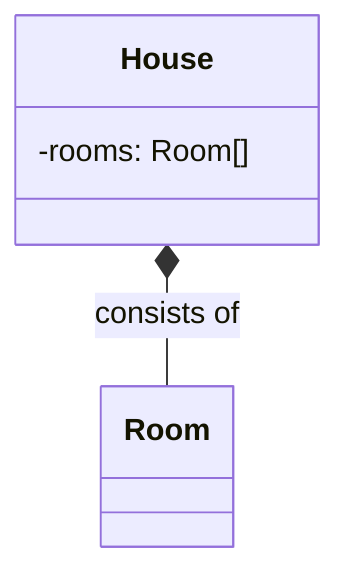

# Skill: Documenting Architecture with UML Diagrams

## Purpose

This skill enables the agent to interpret and generate visual documentation using the Unified Modeling Language (UML). It provides standard notation for representing classes, objects, and their relationships to communicate software design clearly.

## Standard Notation Guide

### 1. Class Structure

- **Box Layout:** Top (Name), Middle (Fields/State), Bottom (Methods/Behavior).
- **Visibility:**
  - `+` : Public — accessible by any class.
  - `-` : Private — accessible only within the class.
  - `#` : Protected — accessible within the class and subclasses.
- **Styling:** Abstract class and method names should be written in _italics_.

### 2. Relationship Symbols

| Relationship       | Symbol in UML                 | Meaning                              |
| :----------------- | :---------------------------- | :----------------------------------- |
| **Inheritance**    | Solid line + Hollow Triangle  | Subclass "is-a" Superclass.          |
| **Implementation** | Dashed line + Hollow Triangle | Class "implements" Interface.        |
| **Association**    | Solid line + Simple Arrow     | Object A "knows" or "uses" Object B. |
| **Aggregation**    | Solid line + Hollow Diamond   | A "has-a" B (B can exist without A). |
| **Composition**    | Solid line + Filled Diamond   | A "consists of" B (B dies with A).   |

## Procedural Instructions

### 1. Interpreting Diagrams

- Identify the "Dominant" class (usually the container in Aggregation/Composition).
- Trace inheritance paths to understand the capabilities of a subclass.
- Look for dashed lines to identify the contracts (Interfaces) the code must fulfill.

### 2. Generating Documentation (Mermaid)

When asked to document code, use the following mapping:

- **Classes:** Create a box for each TypeScript class or interface.
- **Fields:** List private fields with `-` and public getters with `+`.
- **Relationships:**
  - Use inheritance for `extends`.
  - Use implementation for `implements`.
  - Use composition for objects instantiated inside the constructor.

## Example: Code to UML Mapping

```typescript
class House {
  private rooms: Room[] = []; // COMPOSITION
  constructor() {
    this.rooms.push(new Room());
  }
}
```



## Payoff

- **Clarity:** Provides a "big picture" view of the system that is hard to see in raw code.
- **Standardization:** Uses a language understood by developers worldwide.
- **Knowledge Transfer:** Simplifies onboarding for new team members and AI agents.
