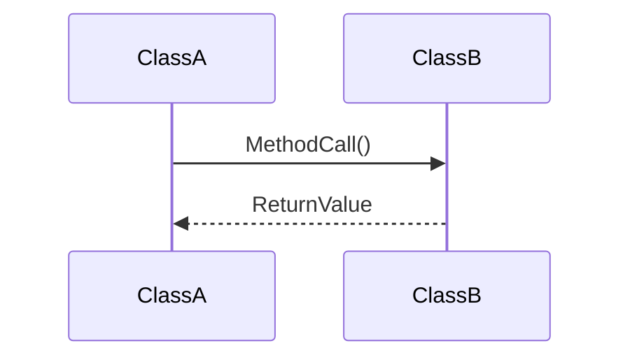
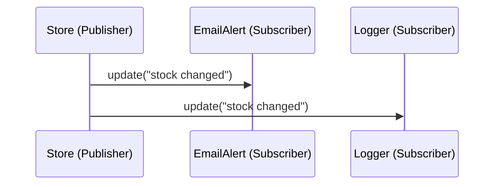

# Skill: Advanced UML — Interaction and Sequence Diagrams

## Purpose

This skill enables the agent to document and interpret how objects interact over time using Sequence Diagrams. It is crucial for explaining behavioral patterns like Observer, Mediator, and Command.

## Notation Guide

### 1. Lifelines and Activation

- **Lifelines:** Vertical dashed lines representing an object's existence over time.
- **Activation Bar:** Thin rectangle on the lifeline showing when an object is actively performing an operation.

### 2. Message Arrows

- **Synchronous Call:** Solid line with a filled arrowhead (waiting for response).
- **Return Message:** Dashed line with a simple arrowhead.
- **Asynchronous Call:** Solid line with a simple arrowhead (no waiting).

## Procedural Instructions

### 1. Mapping Patterns to Interaction

- **Observer:** Show the `Publisher` sending `notify()` to all `Subscriber` lifelines.
- **Mediator:** Show multiple `Component` lifelines sending events to the `Mediator`, and the `Mediator` dispatching calls back to them.

### 2. Generating Mermaid Sequence Code

When documenting logic, use the following structure:

### 3. Example: Observer Pattern

## Payoff

- **Clarity in Logic:** Visualizes complex message passing that is hard to trace in code.
- **Standardized Documentation:** Uses industry-standard notation understood by humans and agents.
- **Pattern Verification:** Confirms that behavioral patterns are implemented correctly.
